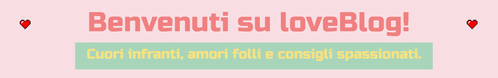
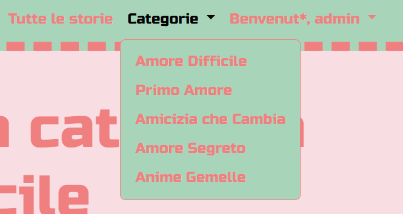
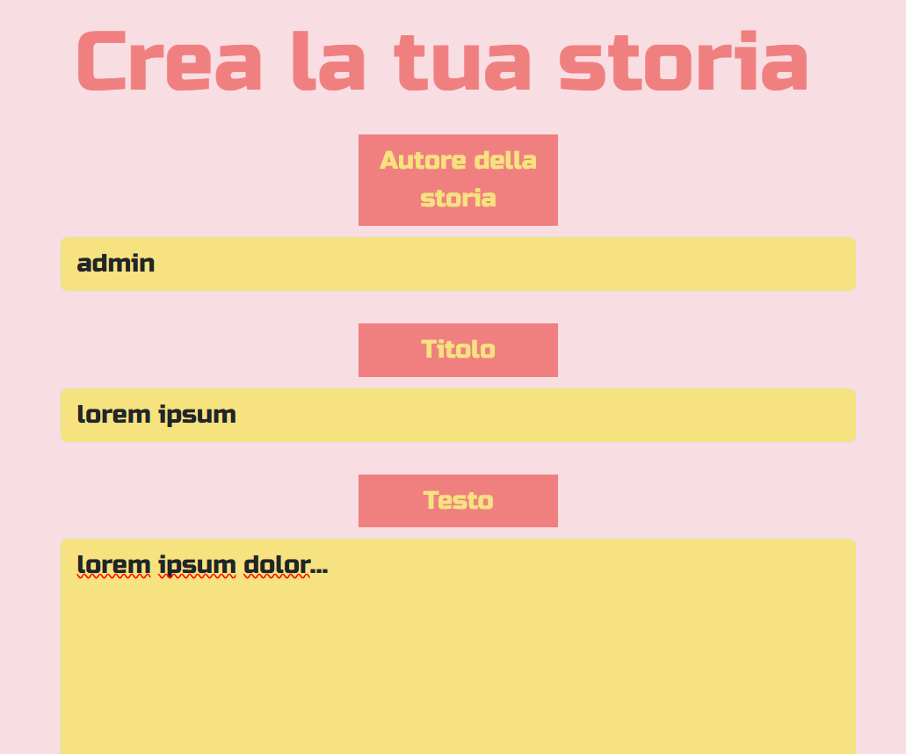
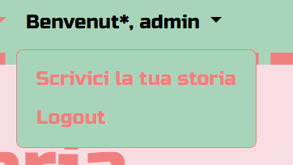

# LoveBlog

Benvenuti in **LoveBlog**, un progetto full-stack che ho realizzato con passione durante il mio percorso di formazione come sviluppatrice web. Si tratta di una piattaforma blog completamente funzionante, sviluppata con **Laravel**. Il progetto integra anche l'autenticazione tramite **Laravel Fortify** e la creazione di componenti con **Livewire**.

Ho costruito questo progetto per simulare una reale web app di blogging, a completa gestione degli utenti, con CRUD per i post, categorizzazione degli articoli, dashboard personale per gli utenti loggati e un’interfaccia semplice ma efficace. Il tutto con l’obiettivo di mettere in pratica logica back-end, routing, gestione delle risorse e creazione di interfacce responsive.

## Obiettivo del Progetto

L’obiettivo era realizzare un blog dinamico, con sistema di autenticazione, gestione delle possibilità in base al ruolo (pubblicazione e modifica dei post), assegnazione di categorie e tag e una dashboard personalizzata per ogni utente. I post, come in un forum anni 2000, non prevedono l'inserimento di immagini, ma nel dettaglio di ogni storia verrà visualizzata l'immagine profilo dell'autore. Ogni parte è stata progettata per simulare un'applicazione reale utilizzabile da più utenti.

## Tecnologie Utilizzate

- **PHP 8+**
- **Laravel 12**
- **Laravel Fortify** (Autenticazione)
- **Blade** (template engine)
- **Livewire** (components)
- **MySQL**
- **HTML5**
- **CSS3**
- **Bootstrap 5**

## Struttura del Progetto

### **routes/web.php**
Gestisce le rotte principali dell'applicazione.

### **app/Http/Controllers/StoryController.php**
Gestione delle viste relative alle storie. Oltre alle funzioni per visualizzare i form di create/edit e le varie collezioni di card (completa, per categoria o per tag), contiene la funzione middleware() che consente di gestire la protezione delle rotte.

### **resources/views/**
Tutte le viste del progetto sono state organizzate con un approccio minimalista e chiaro, puntando a scrivere meno codice ma con maggiore significato, affidandosi a strumenti che favoriscono la riusabilità dei frammenti che si ripetono.

Per raggiungere questo risultato ho utilizzato:

- **Livewire**: per gestire in modo reattivo e completo il CRUD delle storie e i relativi form per creare una *Single Page Application*

- **Blade Components**: per isolare e ottimizzare gli elementi ripetitivi, trasformandoli in blocchi riutilizzabili facilmente richiamabili nelle viste principali, rendendo il layout modulare e pulito.

Ho voluto implementare questa organizzazione per esercitarmi e perchè penso possa migliorare la scalabilità dei progetti e semplificare notevolmente il processo di sviluppo.

### **database/migrations/**
Le migrazioni definiscono e popolano le tabelle: **users**, **stories**, **categories**, **tags**.
Per definire la relazione many to many tra storie e tag è stato necessario creare la tabella pivot *story_tag*.

### **app/Models/**
Modelli Eloquent per la rappresentazione delle tabelle relative. Alcuni modelli sono legati da delle relazioni:

- Story -> *oneToMany* ->  Category
- Story -> *oneToMany* ->  Users
- Story -> *manyToMany* ->  Tags

### **database/seeders/**
Utilizzati per popolare le taballe tags e categories.

### **Laravel Fortify**
Fortify gestisce tutto il sistema di autenticazione:

- Login
- Registrazione
- Logout

Il modello User e la tabella users sono stati personalizzati per permettere all'utente l'inserimento di una foto profilo.

## **Design e UI**

- **Framework**: Bootstrap 5
- **Responsive**: sì, ottimizzato per dispositivi mobili
- **Stile**: semplice, pulito, funzionale, nostalgico

## Riassunto Funzionalità Implementate

- **Registrazione** e login utenti
- **CRUD** completo per storie con **Livewire**
- **Relazioni** One to Many e Many to Many
- Dashboard personalizzata auth/guest
- **Middleware**
- **Validazione** server-side
- Interfaccia responsive
- **Seeder** 
- Minimizzazione delle viste con **Blade Components**

